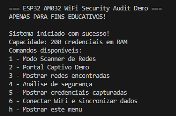
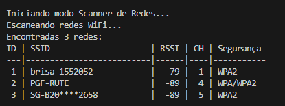
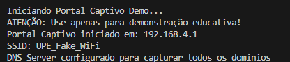
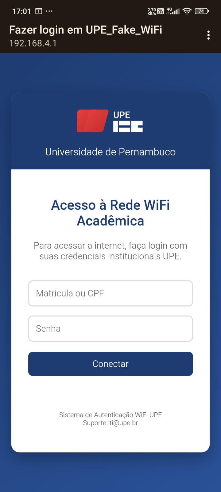
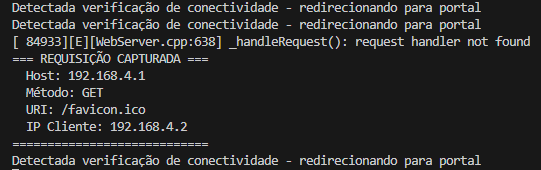
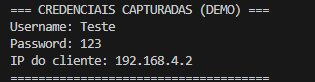
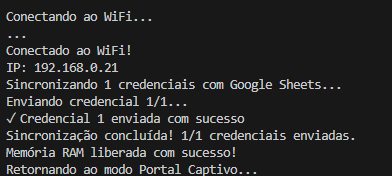
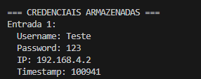
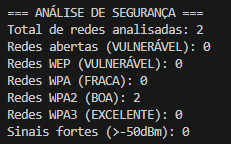
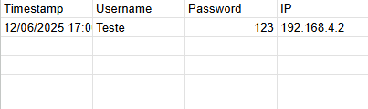

# ESP32 WiFi Security Audit Demo

## 📋 Descrição do Projeto

Este projeto implementa um sistema completo de auditoria de segurança WiFi usando ESP32, desenvolvido exclusivamente para fins educativos e didáticos. O sistema demonstra conceitos fundamentais de segurança em redes sem fio através de três módulos principais:

### Funcionalidades Principais

1. **📡 Scanner de Redes WiFi**
   - Detecta e analisa redes WiFi no ambiente
   - Coleta informações detalhadas (SSID, BSSID, RSSI, Canal, Segurança)
   - Executa scans periódicos automáticos
   - Suporta detecção de até 50 redes simultaneamente

2. **🌐 Portal Captivo Educativo**
   - Simula um portal captivo realístico
   - Interface moderna inspirada em portais universitários
   - Demonstra técnicas de phishing WiFi
   - Captura credenciais para análise educativa
   - Sistema de armazenamento local com sincronização automática

3. **🔍 Análise de Vulnerabilidades**
   - Identifica redes abertas e protocolos fracos
   - Gera relatórios de segurança detalhados
   - Fornece recomendações personalizadas
   - Detecta padrões suspeitos e potenciais ameaças

4. **☁️ Integração Google Sheets**
   - Sincronização automática de dados capturados
   - Armazenamento em nuvem para análise posterior
   - Sistema de backup e recuperação
   - Interface web para visualização de dados


## 🛠️ Lista de Materiais

### Hardware Necessário
- **1x ESP32 Development Board** (NodeMCU ou similar)
- **1x Cabo USB** (tipo A para micro USB)
- **1x Computador** com Windows/Linux/macOS
- **1x Smartphone/Tablet** (para testes do portal captivo)

### Software Necessário
- **PlatformIO IDE** ou **Arduino IDE**
- **Visual Studio Code** (recomendado)
- **Google Chrome/Firefox** (para interface web)
- **Google Account** (para integração com Sheets)


## 🚀 Instruções para Replicar

### Passo 1: Preparação do Ambiente

1. **Instale o PlatformIO**
   ```bash
   # No Visual Studio Code, instale a extensão PlatformIO
   # Ou baixe o PlatformIO Core:
   pip install platformio
   ```

2. **Clone o Repositório**
   ```bash
   git clone <repositorio>
   cd RealTriangulatioin
   ```

### Passo 2: Configuração do Hardware

1. **Conecte o ESP32**
   - Conecte o ESP32 ao computador via cabo USB
   - Verifique se os drivers estão instalados
   - Identifique a porta COM (Windows) ou /dev/ttyUSB (Linux)

2. **Verificação da Conexão**
   ```bash
   # Teste a comunicação
   pio device list
   ```

### Passo 3: Configuração do Software

1. **Configure o arquivo `platformio.ini`**
   ```ini
   [env:esp32dev]
   platform = espressif32
   board = esp32dev
   framework = arduino
   monitor_speed = 115200
   upload_port = COM3  ; Ajuste para sua porta, caso necessário
   ```

2. **Instale as Dependências**
   ```bash
   pio lib install "WiFi" "WebServer" "DNSServer" "ArduinoJson" "HTTPClient"
   ```

### Passo 4: Configuração do Google Sheets (Opcional)

1. **Crie um Google Apps Script**
   - Acesse [script.google.com](https://script.google.com)
   - Crie um novo projeto
   - Cole o código de integração (fornecido separadamente)
   - Configure as permissões

2. **Configure a URL no código**
   ```cpp
   const char* googleScriptURL = "SUA_URL_AQUI";
   ```

3. **Configure suas credenciais WiFi**
   ```cpp
   const char* wifiSSID = "SUA_REDE_WIFI";
   const char* wifiPassword = "SUA_SENHA_WIFI";
   ```

### Passo 5: Compilação e Upload

1. **Compile o Projeto**
   ```bash
   pio run
   ```

2. **Faça o Upload**
   ```bash
   pio run --target upload
   ```

3. **Abra o Monitor Serial**
   ```bash
   pio device monitor --baud 115200
   ```

### Passo 6: Teste das Funcionalidades

1. **Teste o Scanner**
   - Digite `1` no monitor serial
   - Aguarde o scan automático das redes
   - Verifique a lista de redes detectadas

2. **Teste o Portal Captivo**
   - Digite `2` no monitor serial
   - Conecte um dispositivo na rede "UPE_Fake_WiFi"
   - Tente acessar qualquer site
   - Observe o redirecionamento para o portal

3. **Teste a Análise de Segurança**
   - Digite `4` no monitor serial
   - Revise o relatório de vulnerabilidades
   - Implemente as recomendações sugeridas

### Passo 7: Monitoramento e Logs

1. **Interface Serial**
   ```
   Comandos disponíveis:
   1 - Modo Scanner de Redes
   2 - Portal Captivo Demo
   3 - Mostrar redes encontradas
   4 - Análise de segurança
   5 - Mostrar credenciais capturadas
   6 - Conectar WiFi e sincronizar dados
   h - Mostrar este menu
   ```

2. **Logs Esperados**
   ```
   === ESP32 AM032 WiFi Security Audit Demo ===
   Sistema iniciado com sucesso!
   Capacidade: 200 credenciais em RAM
   ```

## 📱 Printscreen do Projeto Funcionando

### 1. Início do Sistema

*Inicialização do sistema mostrando o menu de comandos disponíveis*

### 2. Scanner de Redes WiFi

*Resultado do scanner mostrando as redes WiFi detectadas*


*Redes WiFi encontradas e armazenadas na memória do sistema*

### 3. Portal Captivo

*Inicialização do módulo de Portal Captivo*


*Interface do Portal Captivo apresentada aos usuários*


*Processo de redirecionamento automático para o Portal Captivo*

### 4. Armazenamento de Credenciais

*Visualização das credenciais capturadas através do Portal Captivo*


*Sistema de persistência que mantém as credenciais mesmo após reinicialização*


*Armazenamento de credenciais capturadas durante a operação do sistema*

### 5. Análise de Segurança

*Relatório de análise de segurança das redes WiFi detectadas*

### 6. Integração com Google Sheets

*Dados sincronizados com Google Sheets para análise posterior*


## 🌐 Publicação no Hackster.io

**Link da Publicação**: 
[ESP32 WiFi Security Audit Demo](https://www.hackster.io/brunofelixp/esp32-wifi-security-audit-demo-c0d4df)


## 🎓 Objetivos Educacionais

Este projeto ensina conceitos fundamentais de:

- **Protocolos WiFi**: 802.11, WPA/WPA2/WPA3
- **Vulnerabilidades**: Redes abertas, WEP, Evil Twins
- **Técnicas de Ataque**: Portal captivo, DNS hijacking
- **Medidas de Proteção**: Configurações seguras
- **Análise de Riscos**: Identificação e mitigação
- **Ethical Hacking**: Princípios e responsabilidades


**⚠️ Lembre-se**: Use este projeto responsavelmente e apenas para fins educativos!
